<div align="center">

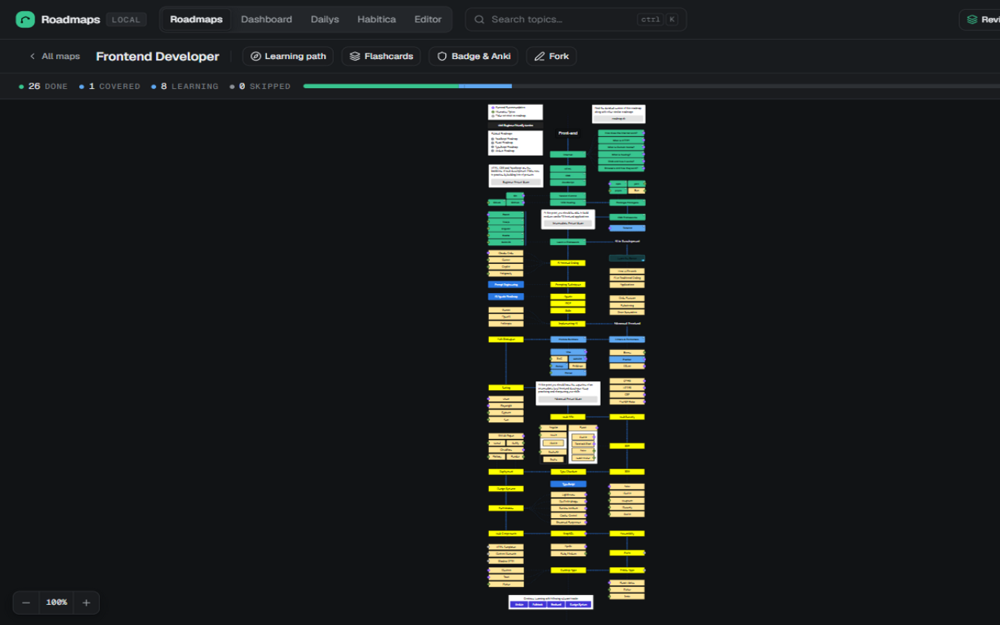

# Skill Trail

**A self-hosted, fully offline learning command center.**

The exact [roadmap.sh](https://roadmap.sh) developer roadmaps — pixel-identical — plus
progress tracking, spaced repetition, career analytics and daily challenges.
No account. No tracking. No internet required after setup.

[](https://github.com/OWNER/REPO/actions/workflows/ci.yml)
[](LICENSE)
[](https://nodejs.org)
[](CONTRIBUTING.md)

[Getting started](#getting-started) · [Features](#features) · [Why Skill Trail](#why-skill-trail) · [FAQ](#faq) · [Contributing](#contributing)

</div>

---

> **Why "Skill Trail"?** Because a career isn't built in a weekend — it's a trail you walk
> one topic at a time. Skill Trail keeps you on that trail, every day, across any of the
> 97 official developer roadmaps.

## What is this?

[roadmap.sh](https://roadmap.sh) is the best free resource for *what* to learn next.
But it's a website: your progress lives in their database (or your browser's memory),
it needs an internet connection, and it forgets when you clear cookies.

**Skill Trail is that same experience, self-hosted and offline:**

- **Pixel-identical roadmaps** — the SVG geometry, Balsamiq handwriting font, node
  layout and edge curves are replicated from the live renderer and verified
  programmatically: **140/140 nodes and 69/69 edges exact** on the frontend roadmap.
- **Your progress is yours** — every mark, note and streak lives in one local
  `data/state.json` file you can back up, copy, or sync between machines.
- **Zero network after setup** — no fonts from CDNs, no analytics beacons, no
  account. The server binds to localhost and never phones home.
- **It goes further than the site** — spaced-repetition review of everything you've
  learned, a LeetCode problem-of-the-day queue, Habitica sync, an iCal review feed,
  and a dashboard that tells you whether your study habit is actually working.

| | roadmap.sh | Skill Trail |
|---|---|---|
| Rendering | ✅ official | ✅ pixel-identical (verified) |
| Works offline | ❌ | ✅ fully |
| Progress | account in their DB | ✅ local `state.json` |
| Review / retention | ❌ | ✅ spaced repetition (1/3/7/14/30/90-day ladder) |
| Career analytics | partial | ✅ gap analysis, velocity, forecasting |
| Daily practice queue | ❌ | ✅ LeetCode POTD, quests, Project Euler |
| Extendable | ❌ | ✅ fork & edit any roadmap |
| Custom roadmaps | ✅ (account) | ✅ offline, with Mermaid import |

## Screenshots

| Home — pick up where you left off | Topic detail with resources |
|---|---|
| 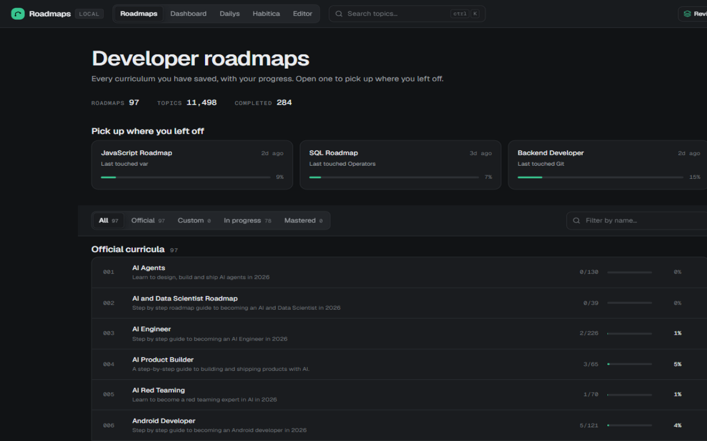 | 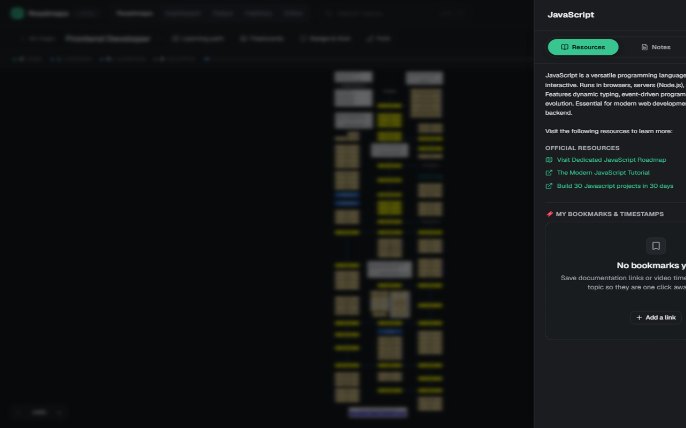 |

| Zoom into the canvas — hand-drawn nodes, statuses & curves | Learning path — your next topics highlighted |
|---|---|
| 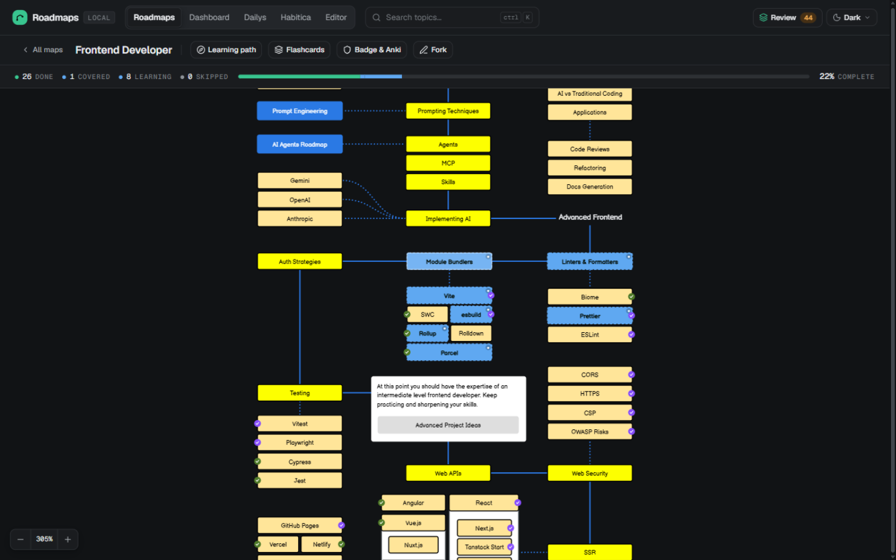 | 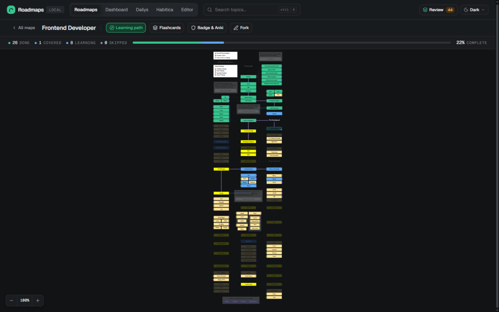 |

| Spaced-repetition flashcards | Study notes + Pomodoro focus timer with ambient sound |
|---|---|
| 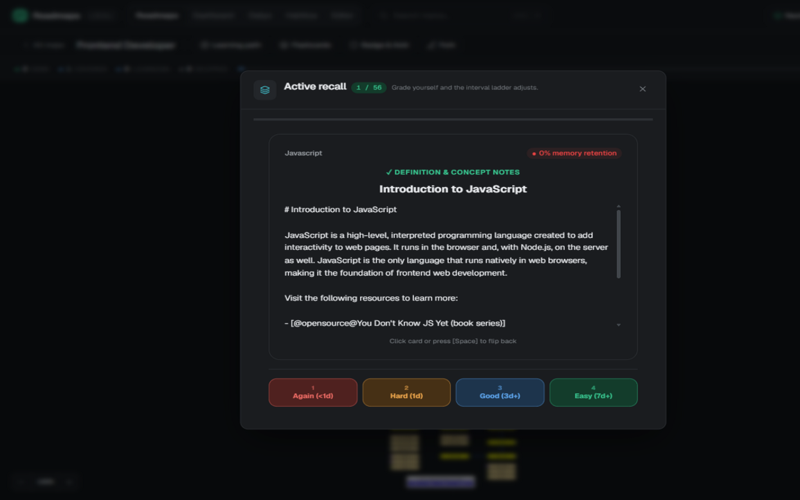 | 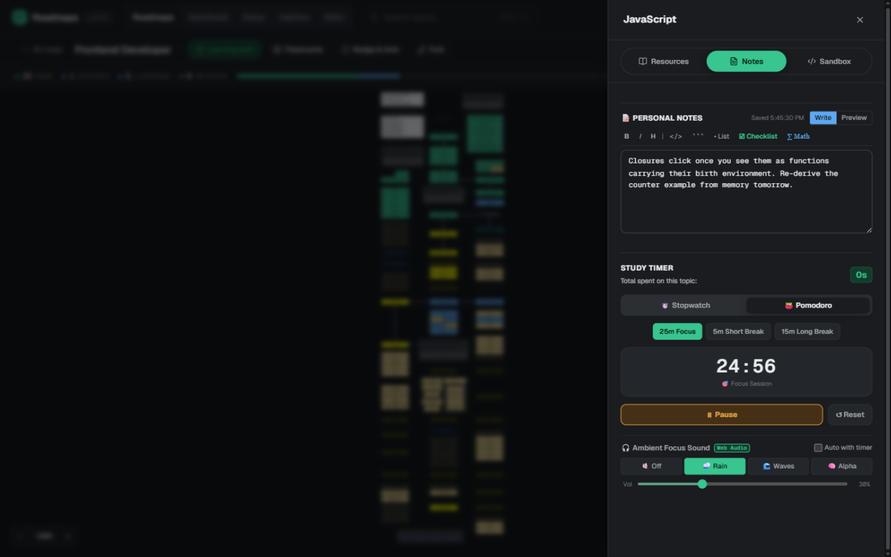 |

| Career role gap analysis | Analytics dashboard |
|---|---|
| 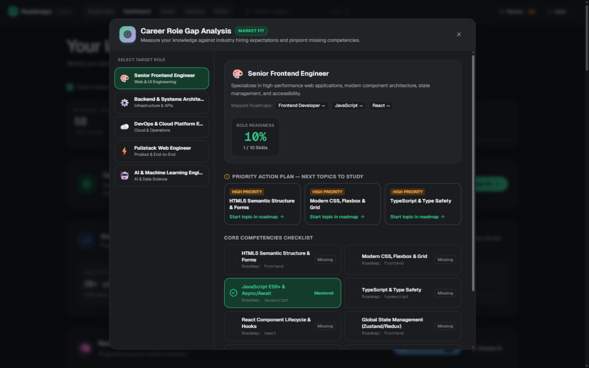 | 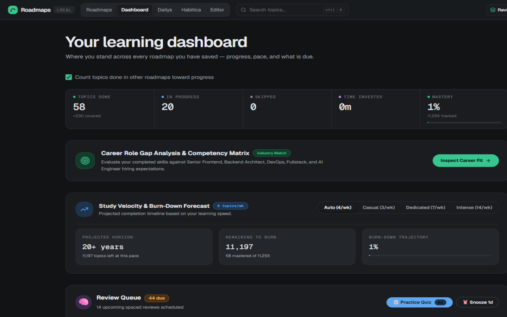 |

| Daily challenge board | In-browser code sandbox |
|---|---|
| 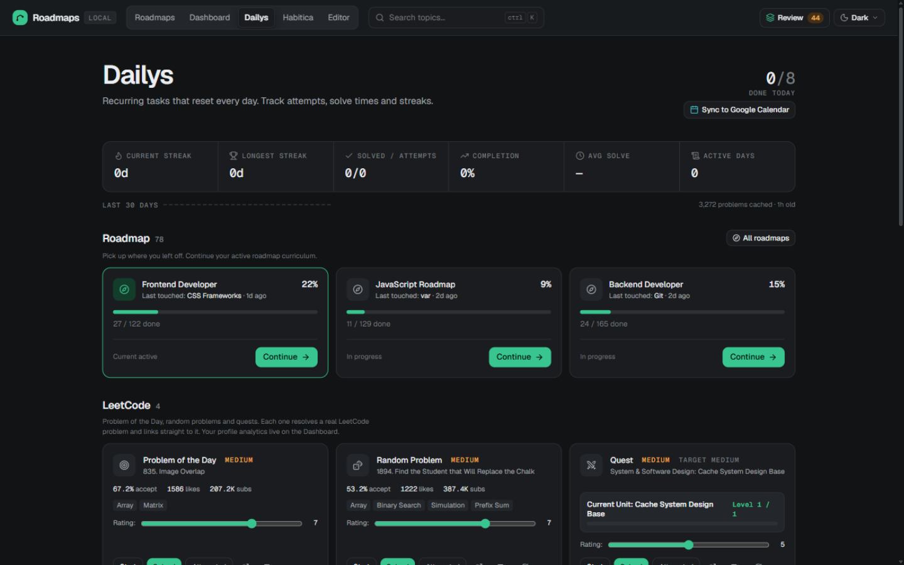 | 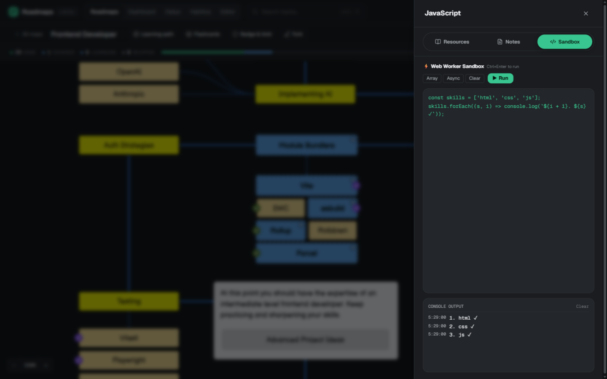 |

| Full-text search (Ctrl+K) | Keyboard shortcuts |
|---|---|
| 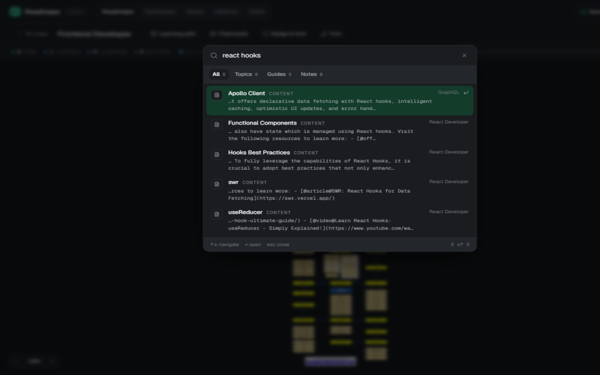 | 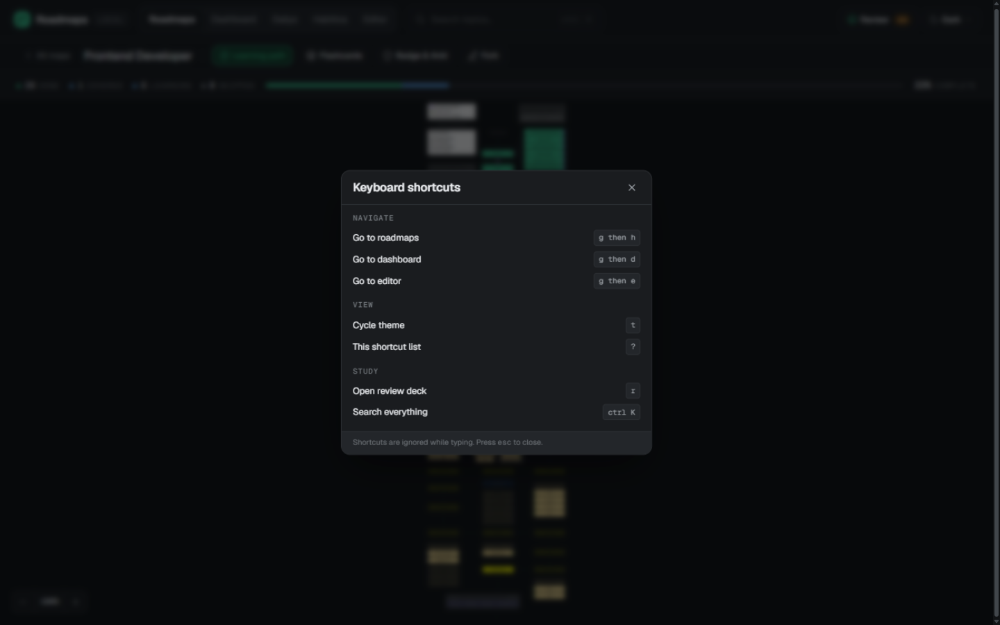 |

| GitHub badge & Anki export | Optional integrations, all off by default |
|---|---|
| 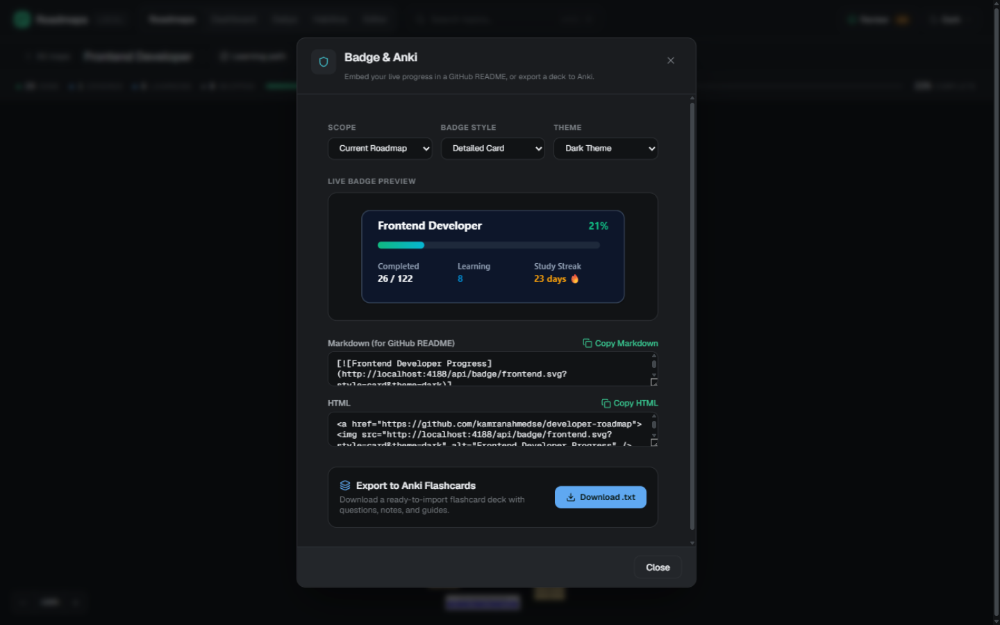 | 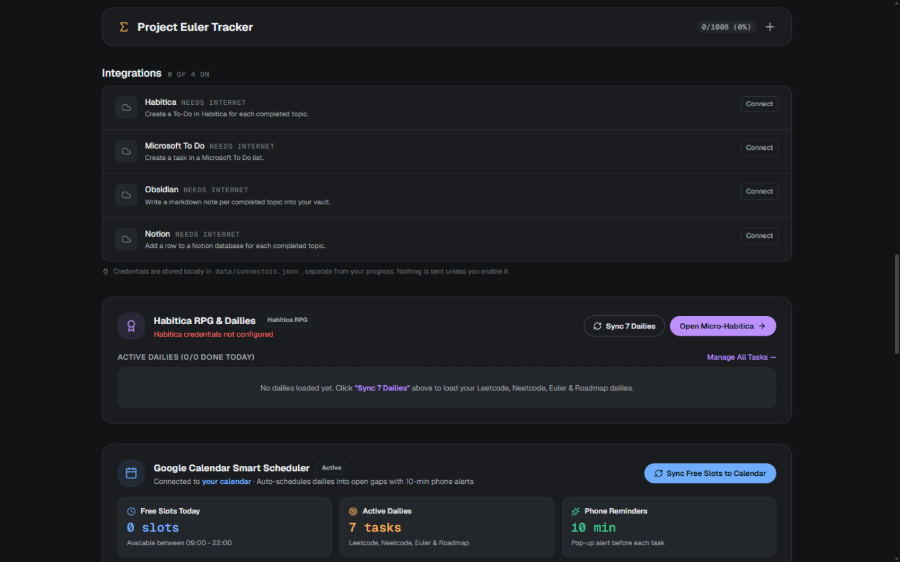 |

Also ships with **light, paper, dark and midnight themes** (see `docs/screenshots/home-light.png`).

## Features

### The roadmaps you already trust
- **All 97 official roadmaps** — Frontend, Backend, AI Engineer, DevOps, Rust, System Design, …
- **Official renderer fidelity** — the same hand-drawn Balsamiq canvas, byte-exact
  node and edge geometry, guarded in CI by `scripts/verify_edges.py`.
- **Topic content & resources** — official markdown guides, curated links and video
  explanations per topic, read offline.
- **Learning path mode** — one click emphasizes the topics on your current path
  through a roadmap.
- **Keyboard-driven** — `?` shows every shortcut: `g` then `h` for home, `g` then `d`
  for dashboard, `t` to cycle themes, `r` for review, `Ctrl+K` for search.

### Consistency engine
- **Progress tracking** — mark any topic *Learning / Done / Skip*; per-roadmap and
  overall completion, plus "already covered in another roadmap" detection.
- **Spaced repetition** — marking a topic done schedules it onto a Leitner-style
  1/3/7/14/30/90-day review ladder. Active-recall flashcards grade themselves
  into long-term memory; a retention ring shows what's actually sticking.
- **Study timer & focus** — per-topic stopwatch or Pomodoro timer with ambient
  focus sounds (rain, waves, alpha) generated in-browser.
- **Notes** — markdown notes per topic (checklists, math, code blocks) with
  live preview, stored in `state.json`.
- **Streaks & heatmap** — daily goal, current/longest streak, milestones.
- **Dailys board** — a habit board that can pull LeetCode's Problem of the Day
  (with a video-explanation link per problem), quests, Project Euler and study
  plans, or your own custom dailies.

### Career analytics
- **Dashboard** — study velocity, completion forecasting, what's due for review today.
- **Role gap analysis** — pick a target role (Senior Frontend, Backend Architect,
  DevOps, Fullstack, AI Engineer…) and see exactly which competencies you're
  missing, each linked to the roadmap that teaches it.
- **Time tracking** — per-topic time logs feeding the velocity forecast.
- **In-browser sandbox** — practice snippets in an isolated Web Worker while
  you study (Ctrl+Enter to run).

### Your data, your machine
- **One-file state** — everything personal lives in `data/state.json`; updates never touch it.
- **Export suite** — high-res PNG, SVG, Markdown, OPML 2.0 (MindNode/OmniOutliner),
  FreeMind `.mm`, Anki deck export, print-to-PDF, and a **standalone portable HTML**
  bundle you can drop on a USB stick and open on any machine.
- **Backup & restore** — one click in-app.

### Integrations (all optional, all off by default)
- **Habitica** — completed topics become to-dos in your Habitica account.
- **LeetCode** — public stats (solved counts, contest rating, streak) from just a username.
- **Google Calendar** — auto-schedule review sessions and dailies into calendar gaps.
- **Obsidian** — one markdown note per completed topic, written straight into your vault.
- **Notion / Microsoft To Do** — completed topics become rows / tasks.
- **SVG badges** — `/api/badge/overall.svg` for your GitHub profile or README.
- **iCal feed** — subscribe to your review schedule from any calendar app.

### Custom roadmaps
- **Fork any official roadmap** and edit it — nodes, edges, labels.
- **Mermaid import** — paste a Mermaid mindmap, get a roadmap.
- **Undo/redo**, keyboard-driven editor.

## Getting started

You need **Node.js ≥ 18** (and `git`, which you already have if you're cloning).
Python 3 is only needed for the optional fidelity check.

```bash
git clone https://github.com/OWNER/REPO.git
cd REPO

npm run bootstrap   # one-time: download the roadmaps + topic content (see note)
npm run setup       # one-time: install dependencies
npm run app:build   # one-time: build the frontend

npm start           # → http://localhost:4177
```

> **Why does setup download content?** The roadmaps themselves are owned by
> roadmap.sh and licensed for personal use — so Skill Trail's repository ships
> application code only, and each user fetches the content from the source onto
> their own machine. It takes ~2 minutes and runs once. Learn more in
> [docs/CONTENT.md](docs/CONTENT.md).

**Windows users:** double-click `run-all.bat` for a menu that does all of the above
(setup / build / start / update / stop), or `Roadmap.bat` for a one-click launch.

**New here?** [docs/GETTING-STARTED.md](docs/GETTING-STARTED.md) walks through every
step with screenshots, troubleshooting for common issues, and the dev setup.

### First five minutes

1. Open <http://localhost:4177> — you'll see all 97 roadmaps.
2. Open the **Frontend Developer** roadmap (or any that matches your goal).
3. Click any topic → mark it **Learning** or **Done**. Done topics enter the review ladder automatically.
4. Hit the **Review** button (top right) when the badge shows a count — that's active recall due today.
5. Press **Ctrl+K** to search every topic, guide and note across all roadmaps.

## Keeping roadmaps current

roadmap.sh updates their roadmaps regularly. To pull the latest:

```bash
npm run update             # check what changed (writes data/update-report.json)
npm run update:download    # fetch changed roadmaps + pull topic content
```

Your progress, notes, streaks and reviews are never touched — they live in
`data/state.json`, separate from roadmap snapshots. `docs/CONTENT.md` shows how to
schedule this weekly on Windows Task Scheduler or cron.

## How it works

```
┌──────────────────────────────────────────────────────────────┐
│  app/       React 18 + Vite + TypeScript frontend             │
│             renderer.ts = pixel-exact official SVG renderer   │
│             served as static files from app/dist              │
├──────────────────────────────────────────────────────────────┤
│  server/    Express API (only dependency: express)            │
│             state.json store · search · reviews · connectors  │
├──────────────────────────────────────────────────────────────┤
│  data/      97 roadmap snapshots · your state (gitignored)   │
│  developer-roadmap/  official topic content (gitignored)     │
└──────────────────────────────────────────────────────────────┘
```

| I want to… | Read |
|---|---|
| Understand the architecture | [docs/ARCHITECTURE.md](docs/ARCHITECTURE.md) |
| Use the HTTP API directly | [docs/API.md](docs/API.md) |
| Contribute / set up dev env | [docs/DEVELOPMENT.md](docs/DEVELOPMENT.md) · [CONTRIBUTING.md](CONTRIBUTING.md) |
| Verify renderer fidelity | [docs/FIDELITY.md](docs/FIDELITY.md) |
| Know where content comes from | [docs/CONTENT.md](docs/CONTENT.md) |
| See the UI design system | [docs/DESIGN.md](docs/DESIGN.md) |
| Follow the changelog | [CHANGELOG.md](CHANGELOG.md) |

## Verification

```bash
python scripts/verify_edges.py   # renderer fidelity → "69/69 exact"
npm test                         # 63/63 passing
cd app && npx tsc -b             # typecheck
```

The fidelity guard re-derives every edge path from the renderer's geometry rules and
diffs them against a fixture captured from the official site — no browser needed, so
it runs in CI on every push and PR.

## FAQ

**Is this legal? / Where does the content come from?**
The application code is original and Apache-2.0 licensed. Roadmap *content* (JSON
snapshots and topic markdown) belongs to roadmap.sh and is licensed for personal use
only — that's why the repo doesn't contain it and `npm run bootstrap` fetches it to
your machine from the official source. You use it under their terms.

**Is it really offline?**
After `bootstrap` + `update`, yes: the app, fonts, roadmaps, topic content and search
index all live on disk. Network features (LeetCode stats, Habitica, calendar sync)
are opt-in and degrade gracefully with no connection.

**Where is my data?**
`data/state.json` (progress, notes, streaks, custom roadmaps). Copy that one file to
back up or move everything. Integration credentials live in `data/connectors.json`
and `.env` — both gitignored.

**How do I use it on a second machine?**
Clone the repo there, run `npm run bootstrap && npm run setup && npm run app:build`,
then copy your `data/state.json` over.

**Can I add my own roadmap?**
Yes — fork an official one or import a Mermaid mindmap in the Editor, then edit
nodes and edges with undo/redo.

**Why does the canvas look hand-drawn?**
That's the official roadmap.sh aesthetic — the Balsamiq Sans font and geometry are
part of the fidelity contract, guarded in CI.

## Contributing

Contributions are welcome — see [CONTRIBUTING.md](CONTRIBUTING.md) for the setup and
the checks to run before a PR. By participating you agree to the
[Code of Conduct](CODE_OF_CONDUCT.md); to report a vulnerability, see
[SECURITY.md](SECURITY.md).

## Acknowledgements & licensing

- **Roadmap content** — © [roadmap.sh](https://roadmap.sh) /
  [kamranahmedse/developer-roadmap](https://github.com/kamranahmedse/developer-roadmap),
  used under their terms for personal use. This project is not affiliated with
  roadmap.sh. Their license does not permit redistributing the content, which is
  why you download it yourself during setup.
- **Application code** — Apache-2.0. See [LICENSE](LICENSE).
- **Fonts** — Balsamiq Sans (roadmap canvas, matching the official renderer) and
  Geist / Geist Mono (UI), self-hosted under their respective licenses.

If roadmap.sh ever changes their content license, the bootstrap step disappears
and the content ships in-repo — the app wouldn't change at all.

---

<div align="center">

**Walk the trail. One topic a day.**

⭐ Star this repo if Skill Trail keeps you learning.

</div>
